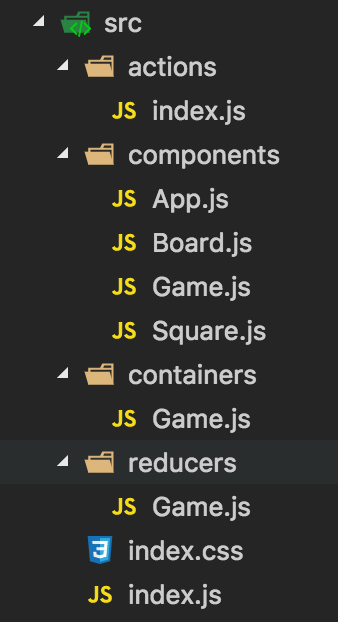
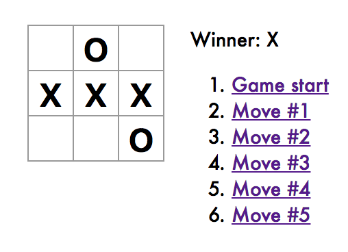

# Huiseoul 개발환경 적응기
`Huiseoul` 플랫폼팀에 합류했습니다. 이전에 사용하던 Spring Framework + RDB와 전혀 다른 개발 환경속에서 팀원들의 많은 도움을 받으며 적응중입니다.

`Huiseoul`은 front 개발환경으로 컴포넌트 재사용에 용이한 `React`, React state를 관리하기 위한 `MobX`, Type에 관대한 JavaScript를 사용할 때 발생할 수 있는 미연의 오류를 방지하고 명확한 코드 작성을 위해 `TypeScript`를 사용하고 있습니다.

이 글에서는 [React 공식 tutorial](https://facebook.github.io/react/tutorial/tutorial.html)인 React tic-tac-toe에 state container인 `Redux`를 입히는 과정을 다루겠습니다.

## 왜 MobX가 아니라 Redux였나?
MobX는 annotation과 decorator를 사용하여 알아서 해주는게 많기 때문에 눈에 보이는 구조 변화가 필요한 Redux가 State Management Library를 이해하는데 좀 더 용이하다고 판단했습니다.
`React-Redux` 조합이 널리 사용되고 있어, 참고할 수 있는 자료가 많다는 것도 초심자에게는 중요한 포인트였습니다.

## React?
React를 가장 정확하고 잘 설명한 곳은 역시 [React 공식페이지](https://facebook.github.io/react/) 입니다.
따라서 구구절절한 이야기들은 생략하고, React를 접하면서 중요한 개념들이라고 생각했던 부분들만 간략히 정리하겠습니다.
- Facebook이 만들고 사용하고 있습니다.
- View의 변화가 찾은 페이지에 적합합니다.
- JUST THE UI(컴포넌트 기반)
> - MVC 모델에서 View를 Component로 만들어 User-Interaction에 집중했습니다.
> - Component 재사용에 용이합니다.
- VIRTUAL DOM
> - React Virtual-Dom이 지속적으로 Component 내부의 데이터를 변화감지하여 변경된 부분만 View에 적용될 수 있도록 합니다.
> - 필요한 부분만 변경하기 때문에 빠릅니다.
> - 사용자는 데이터 변화보다 UI에 좀 더 집중할 수 있습니다.
> - 실제 DOM에 접근하여 조작하는 대신에 이를 추상화 시킨 JavaScript 객세를 구성하여 동작하며 데이터가 변경되면 UI를 Virtual DOM에 렌더링 한 후 이전 Virtual DOM과 비교하여 바뀐 부분만 실제 DOM에 반영하는 방식입니다.
- 단방향 DATA FLOW
> - 모든 데이터 모델을 단일 Root에서 시작하여 계층 구조로 사용합니다.
> - 따라서 데이터 흐름이 명시적입니다.

## Redux?
### Flux?
`Redux`를 더 쉽게 이해하기 위해 잠시 `Flux 패턴`에 관해 설명하겠습니다.

앞서 React가 MVC(Model-View-Controller) 패턴에서 V에 해당하는 View에 집중했다고 언급했습니다.

MVC은 아래 그림과 같은 패턴입니다.


여기서 View가 많아지면 어떻게 될까요?


Model & View 가 추가될 때 마다 복잡도가 증가하고, 프로젝트 규모가 기하급수적으로 늘어납니다. 점차 각 Model & View의 관계도 파악하기 어려워 지고요.

이런 MVC 단점을 보완해줄 수 있는 패턴이 `Flux`입니다.


Flux 패턴에서 `Store`는 어플리케이션의 모든 데이터 변화를 담고있습니다. `Action`이 발생했을 때, `Dispatcher`는 `Store`를 어떻게 갱신할지 결정합니다. 이 후 `Store`가 변경되면 `Store` 내부의 데이터도 바뀌므로 `View`도 갱신됩니다. 정리하자면, `Dispatcher`가 `Action`으로 인한 데이터 변경로직을 결정하면 `Store`에 변경된 데이터가 쌓여 `View`도 갱신해주는거죠.


### Redux?

`React-Redux`에 대해 알아보자고 하고, `Flux 패턴`에 관한 설명이 길어졌는데요, 결국 Redux는 Flux 패턴을 좀 더 쉽고 정돈된 형태로 쓸 수 있게 도와주는 라이브러리입니다.

`Redux`는 `state management library`입니다. Framework 아니고 library입니다. JavaScript Application에서 Data-state와 UI-state를 관리해주는 도구입니다.

`Redux`에서 중요한 개념은 크게 3가지 입니다.

- Action
- Reducer
- Store

#### Action
`Action`에서는 상태변화가 있을법한 상황들을 미리 정의합니다.

#### Reducer
그럼 `Reducer`에 `Action`이 일어났을 때 어떻게 상태를 바꿔줄지 로직을 담습니다.
> - Action의 결과가 Reducer로 분배되고,
> - Redux가 새로운 state를 계산하는데 쓰입니다.

#### Store
변경된 상태들은 `Store`에 담기게 됩니다. 이 때, `Store` 내부의상태 변화에 따라 `View`도 함께 변화해야하기 때문에 `Store`와 `View`를 연결해줄 필요가 있습니다. React에서는 Component가 되겠죠.

연결과정은 다음과 같습니다.
> 1. 최상위 React Component에(ex. root)에 store를 만듭니다.
> ```
> import { createStore } from 'redux';
> ...
> store = createStore(reducer);
> ```
> 2. Provider로 전체 앱을 한 번 감싸줍니다.
> ```
> import { Provider } from 'react-redux';
> ...
> ReactDOM.render(
>   <Provider store={store}>
>     <App />
>   </Provider>,
>   document.getElementById('app');
> );
> ```
> 3. Provider Component가 제공하는 connec()함수를 이용하여 Component와 store를 연결한다.
> ```
> import { connect } from 'react-redux';
> ...
> // component의 props에 매핑할 상태를 정의
> // 기존 React Component 내부의 constructor()
> const mapStateToProps = (state) => ({
>   myState: state.myState,
>   ...
> });
>
> // dispatcher를 component의 props에 매핑
> const mapDispatchToProps = (dispatch) => ({
>   yourReducerFunction(index) {
>     dispatch(yourReducerFunction(index));
>   },
>   ...
> });
>
> // 연결!!
> export default connect(mapStateToProps, mapDispatchToProps)(YourComponent);
> ```

## React with Redux Tic-Tac-Toe?

이제 [`React Tic-Tac-Toe Tutorial`](https://facebook.github.io/react/tutorial/tutorial.html)에 `Redux`를 입혀보곘습니다.
[`최종결과를 확인하고 코드를 fork 해보세요.`](https://codepen.io/gaearon/pen/gWWZgR?editors=0010)

제 repository를 clone하셔도 좋습니다.
```
$ git@github.com:SeeArtSun/react-tic-tac-toe.git
```

실행해보세요.
```
$ npm start
```

### Step1. React Component 분리
Tutorial 최종 결과에서 중요한 코드는 [`index.js`](https://gist.github.com/SeeArtSun/261f398b3b9eb430e450ff8dc9fe2a96) 뿐입니다.
하지만 이 파일에는 Tic-Tac-Toe 놀이판의 한 칸 한 칸에 해당하는 `Square Component`, 놀이판에 해당하는 `Board Compoent`, 전체 게임을 관리하는 `Game Component` 가 모두 담겨있습니다.
해서 이 Component들을 각각의 파일로 분리하겠습니다.

https://gist.github.com/SeeArtSun/c2ed113c622a6c6161ead0e76cac2409

### Step2. Redux 설치

프로젝트 디렉토리 안에서 `redux`와 `react-redux`를 설치하고 package.json에 추가합니다.
`react-redux`는 redux를 컴포넌트 상에서 더 간편하게 사용 할 수 있게 해 주는 라이브러리입니다. react-redux를 사용하면 컴포넌트에서 store를 props으로 받아오거나, subscribe를 직접 하지 않아도 됩니다.
```
$ npm install --save redux react-redux
```

### Step3. Action 정의

`action` 코드를 쓸 디렉토리를 만들고, 파일을 생성합니다.
```
$ mkdir -p src/actions & touch src/actions/
index.js
```

`Action`에서 상태변화가 있을 법한 상황들을 미리 정의한다고 했습니다.
[Tic-Tac-Toe 튜토리얼](https://codepen.io/gaearon/pen/gWWZgR?editors=0010) 게임을 직접 해보면, `1) Player가 수를 두는 행위`와 `2) History로 이동하는 행위` 정도가 있을 것 같습니다.

저는 Player가 수를 두는 행위는 `ADD_SYMBOL`, History로 이동하는 행위는 `JUMP_TO_HISTORY`라고 부르려고 합니다.

- /src/actions/index.js
https://gist.github.com/SeeArtSun/54a329e3fbe846ece353afedffde9ee0

각각의 Action은 `type`을 필수로 가져야합니다. 후에 `type`은 실제 logic을 담고있는 `Reducer`에서 `Action`명을 구분할 때 사용됩니다.

argument로는 index(number)를 받습니다.
tic-tac-toe에서 board는 배열이고, history 또한 board의 배열로 구현했기 때문에 어떤 위치에 수를 두고, 어느 history로 돌아갈지 배열의 index로 구분합니다.

이 상태로 실행하더라도 아직 `Store`와 `Component`를 연결하지 않았기 때문에 결과는 변하지 않습니다.

### Step4. Reducer 구현 및 Store 연결

`reducer` 코드를 쓸 디렉토리를 만들고, 파일을 생성합니다.
```
$ mkdir -p src/reducers & touch src/reducers/Game.js
```

이 후 부터는 Reducer에 logic을 구현하고, Component에 있던 logic을 뺄겁니다.
최종적으로는 Component에는 View를 그리는 코드만 남기겠습니다.

#### Step4-1. Reducer 구조 만들기

Reducer는 세 부분으로 이루어져 있습니다.
- import action
- initialState 정의
- reducer 구현

코드를 보실까요?

https://gist.github.com/SeeArtSun/a7e12cdb5b716cafd3899badf860f047

정의해 두었던 `Action`들인 `ADD_SYMBOL`과 `JUMP_RO_HISTORY`를 impot 했습니다.

React는 Component state의 변화에 따라 동작합니다. 따라서 state를 정의해주었고요, 들어오는 Action에 따라 logic이 동작할 수 있도록 reducer를 선언해 주었습니다.
아직 reducer에는 구현된 로직이 없습니다.

#### Step4-2. ADD_SYMBOL(수 두기) 구현

한 번에 모든 Action을 구현하기는 어렵겠죠. 해서 `O`, `X`로 수 두기에 해당하는 `ADD_SYMBOL`를 먼저 구현하겠습니다.

`ADD_SYMBOL`에 어떤 내용들을 채워넣을 지, `/components/Game.js`를 볼까요?

##### /src/components/Game.js 에서 - Component에서 Logic 제거
- `reducers/Game.js`에 `initialState`로 state 구조를 만들어 두었고 reducer에서 state를 return하여 component에서는 props로 받을거기 때문에 `constructor()`는 삭제해도 좋겠습니다.

- react component에서 쓰던 state는 reducer dispatcher를 통해 props로 mapping 할 예정입니다. 위와 동일한 이야기입니다. 때문에 `components/Game.js`의 `state`를 `props`로 바꾸겠습니다.

- `ADD_SYMBOL` 내부를 구현하면 되니 `handleClick()`도 삭제하겠습니다. 대신 이 로직 그대로 ADD_SYMBOL을 구현할테니, 잘 보관해두세요.

- 그리고 아래 코드에서 수 두기에 해당했던 `onClick={(i) => this.handleClick(i)`은 삭제했으니 다른 코드로 대체하겠습니다.
저는 후에 props로 `addSymbol`이라는 메소드로 받아올 생각입니다. 그래서 `onClick={this.props.addSymbol}`로 바꿔놓겠습니다.
```
return (
      <div className="game">
        <div className="game-board">
          <Board
            squares={current.squares}

            // onClick={this.props.addSymbol} 로 바꿔주세요.
            onClick={(i) => this.handleClick(i)}
          />
        </div>
        <div className="game-info">
          <div>{status}</div>
          <ol>{moves}</ol>
        </div>
      </div>
    );
```
- winner 결정도 reducer에서 하려고 합니다. 해서, `calculateWinner()`도 삭제하고, `reducer`에 붙이겠습니다.

이렇게 완성된 코드는 다음과 같습니다.


https://gist.github.com/SeeArtSun/c516078340c8eea844cedcefe43b4aa3#file-game-components-js

##### /src/reducers/Game.js 에서 - Reducer 구현

`/components/Game.js`에서 삭제한 ADD_SYMBOL과 관련된 로직들을 `/reducers/Game.js`로 붙여넣겠습니다.

- 승자를 결정하는 `calculateWinner()`는 그대로 복사해옵니다.

- `Game Component`의 `handleClick()` 내부도 `case ADD_SYMBOL:`안으로 그대로 복사해옵니다.

- 여기서 승자를 결정하는 winner 부분만 살짝 바꿔보겠습니다.  
이미 승자가 정해졌거나, 한 번 수를 두었던 칸은 다시 클릭해도 아무런 동작을 해서는 안됩니다. 클릭 당시의 state를 알고 있어야 하기 때문에 winner state를 받아오도록 하겠습니다.  
```
...
let squares = current.squares.slice();
let winner = state.winner;
...
```

- 지금 둔 수로 승자가 있는지 결정해야 하므로 reducer에서 winner를 선정하여 return합니다.
```
...
return {
  history: history.concat([{
    squares: squares
  }]),
  stepNumber: history.length,
  xIsNext: !state.xIsNext,
  winner: calculateWinner(squares),
};
```

이렇게 완성된 코드는 다음과 같습니다.

https://gist.github.com/SeeArtSun/c516078340c8eea844cedcefe43b4aa3#file-game-reducers-js

그리고 프로그램을 실행해보겠습니다.
오류도 없는데 백지가 나오는군요.
이유는 react와 redux를 연결해줄 연결고리가 없기 때문입니다.
지금부터 훅 지나가니 잘 따라와 주세요.

#### /containers/Game.js에서 - React-Redux 연결

`container` 코드를 쓸 디렉토리를 만들고, 파일을 생성합니다.

`container`는 View를 담당하는 react component와 data를 담당하는 redux 사이에서 state를 연결해주는 역할을 합니다.

component에 container에 들어갈 코드를 동일하게 삽입해도 되지만 component를 최대한 View에 집중시키고 역할을 분리하기 위해 container를 따로 마련하겠습니다.

```
$ mkdir -p src/containers & touch src/containers/Game.js
```

그리고 아래와같이 코드를 작성해주세요.

https://gist.github.com/SeeArtSun/c516078340c8eea844cedcefe43b4aa3#file-containers-game-js

container 에서는 세 가지 일을 할겁니다.

- `mapStateToProps(state)` 를 구현합니다.  
Component의 state를 argument로 받아 props를 return하는 함수로, Component에서는 `this.props.*`로 자유롭게 받아쓸 수 있습니다.  
앞서 `Game component`에서 `this.state.*들을 this.props.*`로 고쳐썼던 이유가 이것입니다.

- `mapDispatchToProps(dispatch)`를 구현합니다.  
`dispatch`라는 callback function을 받아 action을 reducer에 dispatch해주는 역할을 하는 함수로, `mapStateToProps()`와 동일하게 여기서 구현한 이벤트를 Component에서 `this.props.*`로 받아쓸 수 있게 합니다.  
앞서 `Game component`에서 `handleClick()`를 `this.props.addSymbol`로 고쳐썼던 이유가 이것입니다.

- 이것들을 Game Component와 연결해주기 위해 react-redux의 `connect()`를 사용하여 `export`해줍니다.

최종적으로 Component와 Container를 연결을 마치기 위해 `components/App.js` 에 다음과 같이 `import` 해주세요.

```
...
import Game from '../containers/Game';
...
```

프로그램을 실행해보겠습니다. 아직 백지입니다.
reducer와 store, store와 component를 연결해줄 연결고리가 없기 때문입니다.

#### src/index.js 에서 - store 생성 및 Component와 연결

앱의 시작점인 index.js에 store를 생성하여 App 어디서든지 store에 접근할 수 있도록 해보겠습니다.

참고로 Application 하나당 하나의 store를 가질 수 있습니다. 두 개는 안돼요.

우선 store를 만드는 `createStore(reducer)`와 `Provider` Component를 사용하기 위해 다음과 같이 import 합니다.

```
...
import { createStore } from 'redux';
import { Provider } from 'react-redux';
import reducer from './reducers/Game';
...
```

그리고 reducer를 argument로 받아 createStore 하고, 최상위 컴포넌트인 App Component를 Provider로 감싸겠습니다.
`Provider`에 `store`를 설정해주면, parent-child 구조로 하위 컴포넌트들에 따로 데이터를 전달해주지 않아도, 모든 컴포넌트에서 바로 store에 접근할 수 있도록 해줍니다.

```
import ...

const store = createStore(reducer);

ReactDOM.render(
  <Provider store={store}>
    <App />
  </Provider>,
  document.getElementById('root');
);
```

이렇게 완성된 코드는 다음과 같습니다.
https://gist.github.com/SeeArtSun/c516078340c8eea844cedcefe43b4aa3
디렉토리 구조는 다음과 같습니다.


실행해볼까요?

잘 됩니다.
다만 `addSymbol`은 구현했지만, `jumpToHistory`는 구현하지 않았기 때문에, 타임머신 기능은 동작하지 않습니다.

앞의 설명을 참고하여, `components/Game.js`, `containers/Game.js`, `reducers/Game.js`를 수정해서 완성해보세요!

최종 코드는 [여기서](https://github.com/SeeArtSun/tic-tac-toe) 확인해보세요.

## 마치며..

처음 `React`로 tic-tac-toe를 구현하면서 들었던 생각은 `'과연 대형 프로젝트에서도 이 사상 그대로 사용할 수 있을까?'` 였습니다. 데이터 변화는 알아서 감지해주니 어떻게 그릴 것인가에만 집중할 수 있다는건 분명한 장점입니다. 하지만, 계층이 많아질 수록 this.state로만 표기된 데이터의 흐름을 구현자가 모두 인지할 수 있을지, 계층구조가 깊고 넓은 상황에서 Component간의 데이터 교환 시 불필요한 데이터 전달이 반복되어 Depth가 깊은 프로젝트에서는 어렵겠다는 생각이 들었습니다.

`Redux`는 순수 React 만으로 구성된 프로그램의 단점을 보완해줄 수 있는 궁합이 잘 맞는 라이브러리입니다. 초심자인 저에게 각 Module간의 연계를 처음부터 파악하기에 다소 어려운 지점들이 있었습니다. 하지만 Store 하나만을 관리하면 되기때문에, 프로그램 확장에도 용이해 보였습니다. Action, Reducer, Container, Component 로 이루어진 Redux 구성도 각 Module이 자신의 기능에만 집중할 수 있도록 구조화 되어 있어 FrameWork 같다는 느낌도 들었고요. Redux 사상만 잘 따르면 어느정도 구조화된 프로젝트를 작성할 수 있는거지요.

저에게는 React-Redux 조합도 충분히 좋아보였습니다. 그래서 많은 프로젝트에서 React와 Redux를 함께 사용하는 거겠지요. 그렇다면 왜 `Huiseoul`에서 이렇게 괜찮아 보이는 React-Redux 조합을 쓰지않고 `React-MobX` 조합을 사용하는지는 다음 포스팅에서 만나겠습니다.
